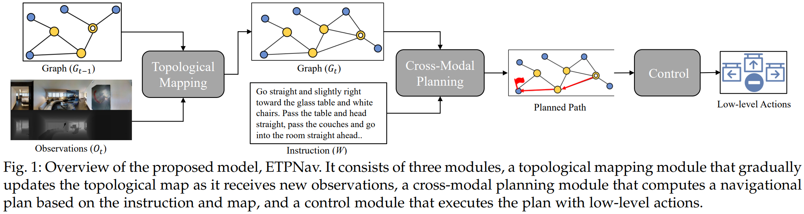
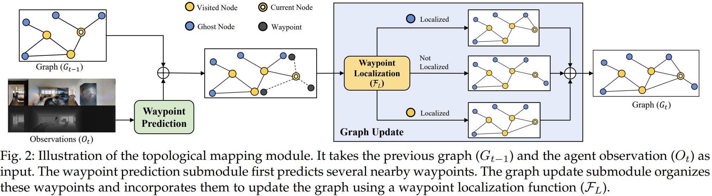
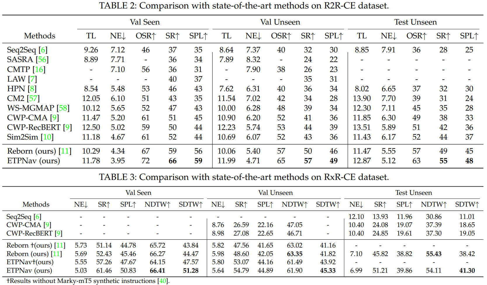

<div align="center">

<h1>ETPNav: Evolving Topological Planning for <br /> Vision-Language Navigation in <br /> Continuous Environments</h1>

<div>
    <a href='https://marsaki.github.io/' target='_blank'>Dong An</a>;
    <a href='https://hanqingwangai.github.io/' target='_blank'>Hanqing Wang</a>;
    <a href='https://sites.google.com/view/wenguanwang'>Wenguan Wang</a>;
    <a href='http://zunwang1.github.io/' target='_blank'>Zun Wang</a>;
    <a href='https://yanrockhuang.github.io/' target='_blank'>Yan Huang</a>;
    <a href='https://scholar.google.com/citations?user=RHPI-NQAAAAJ&hl=zh-CN' target='_blank'>Keji He</a>;
    <a href='https://scholar.google.com/citations?user=8kzzUboAAAAJ&hl=zh-CN' target='_blank'>Liang Wang</a>;
</div>

<h3><strong>Accepted to <a href='https://ieeexplore.ieee.org/xpl/RecentIssue.jsp?punumber=34' target='_blank'>TPAMI 2024</a></strong></h3>

<h3 align="center">
  <a href="https://arxiv.org/abs/2304.03047v2" target='_blank'>Paper</a>
</h3>
</div>

🔥Winner of the [RxR-Habitat Challenge](https://embodied-ai.org/cvpr2022) in CVPR 2022. [[Challenge Report]](https://arxiv.org/abs/2206.11610) [[Challenge Certificate]](https://marsaki.github.io/assets/cert/rxr-habitat-cert.pdf)

This work tackles a practical yet challenging VLN setting - vision-language navigation in continuous environments (VLN-CE). To develop a robust VLN-CE agent, we propose a new navigation framework, ETPNav, which focuses on two critical skills: **1) the capability to abstract environments and generate long-range navigation plans, and 2) the ability of obstacle-avoiding control in continuous environments**. ETPNav performs online topological mapping of environments by self-organizing predicted waypoints along a traversed path, without prior environmental experience. It privileges the agent to break down the navigation procedure into high-level planning and low-level control. Concurrently, ETPNav utilizes a transformer-based cross-modal planner to generate navigation plans based on topological maps and instructions. The plan is then performed through an obstacle-avoiding controller that leverages a trial-and-error heuristic to prevent navigation from getting stuck in obstacles. Experimental results demonstrate the effectiveness of the proposed method. **ETPNav yields more than 10% and 20% improvements** over prior state-of-the-art on R2R-CE and RxR-CE datasets, respectively.

<div align="center">
    
    
</div>

Leadboard:

<div align="center">
    
</div>

## TODOs

* [X] Tidy and release the R2R-CE fine-tuning code.
* [X] Tidy and release the RxR-CE fine-tuning code.
* [X] Release the pre-training code.
* [X] Release the checkpoints.

## Setup

### Installation

Follow the [Habitat Installation Guide](https://github.com/facebookresearch/habitat-lab#installation) to install [`habitat-lab`](https://github.com/facebookresearch/habitat-lab) and [`habitat-sim`](https://github.com/facebookresearch/habitat-sim). We use version [`v0.1.7`](https://github.com/facebookresearch/habitat-lab/releases/tag/v0.1.7) in our experiments, same as in the VLN-CE, please refer to the [VLN-CE](https://github.com/jacobkrantz/VLN-CE) page for more details. In brief:

1. Create a virtual environment. We develop this project with Python 3.6.

   ```bash
   conda env create -f environment.yaml
   ```
2. Install `habitat-sim` for a machine with multiple GPUs or without an attached display (i.e. a cluster):

   ```bash
   conda install -c aihabitat -c conda-forge habitat-sim=0.1.7 headless
   ```
3. Clone this repository and install all requirements for `habitat-lab`, VLN-CE and our experiments. Note that we specify `gym==0.21.0` because its latest version is not compatible with `habitat-lab-v0.1.7`.

   ```bash
   git clone git@github.com:MarSaKi/ETPNav.git
   cd ETPNav
   python -m pip install -r requirements.txt
   pip install torch==1.9.1+cu111 torchvision==0.10.1+cu111 -f https://download.pytorch.org/whl/torch_stable.html
   ```
4. Clone a stable `habitat-lab` version from the github repository and install. The command below will install the core of Habitat Lab as well as the habitat_baselines.

   ```bash
   git clone --branch v0.1.7 git@github.com:facebookresearch/habitat-lab.git
   cd habitat-lab
   python setup.py develop --all # install habitat and habitat_baselines
   ```

### Scenes: Matterport3D

Instructions copied from [VLN-CE](https://github.com/jacobkrantz/VLN-CE):

Matterport3D (MP3D) scene reconstructions are used. The official Matterport3D download script (`download_mp.py`) can be accessed by following the instructions on their [project webpage](https://niessner.github.io/Matterport/). The scene data can then be downloaded:

```bash
# requires running with python 2.7
python download_mp.py --task habitat -o data/scene_datasets/mp3d/
```

Extract such that it has the form `scene_datasets/mp3d/{scene}/{scene}.glb`. There should be 90 scenes. Place the `scene_datasets` folder in `data/`.

### Data and Trained Weights

* Waypoint Predictor: `data/wp_pred/check_cwp_bestdist*`

  * For R2R-CE, `data/wp_pred/check_cwp_bestdist_hfov90` [[link]](https://drive.google.com/file/d/1goXbgLP2om9LsEQZ5XvB0UpGK4A5SGJC/view?usp=sharing).
  * For RxR-CE, `data/wp_pred/check_cwp_bestdist_hfov63 `[[link]](https://drive.google.com/file/d/1LxhXkise-H96yMMrTPIT6b2AGjSjqqg0/view?usp=sharing) `(modify the suffix to hfov63)`.
* Processed data, pre-trained weight, fine-tuned weight [[link]](https://drive.google.com/file/d/1MWR_Cf4m9HEl_3z8a5VfZeyUWIUTfIYr/view?usp=share_link).

  ```
  unzip etp_ckpt.zip    # file/fold structure has been organized
  ```

  overall, files and folds are organized as follows:

  ```
  ETPNav
  ├── data
  │   ├── datasets
  │   ├── logs
  │   ├── scene_datasets
  │   └── wp_pred
  └── pretrained
      └── ETP
  ```

## Running

Pre-training

Download the pretraining datasets [[link]](https://www.dropbox.com/sh/u3lhng7t2gq36td/AABAIdFnJxhhCg2ItpAhMtUBa?dl=0) (the same one used in [DUET](https://github.com/cshizhe/VLN-DUET)) and precomputed features [[link]](https://drive.google.com/file/d/1D3Gd9jqRfF-NjlxDAQG_qwxTIakZlrWd/view?usp=sharing), unzip in folder `pretrain_src`

```
CUDA_VISIBLE_DEVICES=0,1 bash pretrain_src/run_pt/run_r2r.bash 2333
```

Finetuning and Evaluation

Use `main.bash` for `Training/Evaluation/Inference with a single GPU or with multiple GPUs on a single node.` Simply adjust the arguments of the bash scripts:

```
# for R2R-CE
CUDA_VISIBLE_DEVICES=0,1 bash run_r2r/main.bash train 2333  # training
CUDA_VISIBLE_DEVICES=0,1 bash run_r2r/main.bash eval  2333  # evaluation
CUDA_VISIBLE_DEVICES=0,1 bash run_r2r/main.bash inter 2333  # inference
```

```
# for RxR-CE
CUDA_VISIBLE_DEVICES=0,1,2,3 bash run_rxr/main.bash train 2333  # training
CUDA_VISIBLE_DEVICES=0,1,2,3 bash run_rxr/main.bash eval  2333  # evaluation
CUDA_VISIBLE_DEVICES=0,1,2,3 bash run_rxr/main.bash inter 2333  # inference
```

# Contact Information

* dong DOT an AT cripac DOT ia DOT ac DOT cn, [Dong An](https://marsaki.github.io/)
* hanqingwang AT bit DOT edu DOT cn, [Hanqing Wang](https://hanqingwangai.github.io/)
* wenguanwang DOT ai AT gmail DOT com, [Wenguan Wang](https://sites.google.com/view/wenguanwang)
* yhuang AT nlpr DOT ia DOT ac DOT cn, [Yan Huang](https://yanrockhuang.github.io/)

# Acknowledge

Our implementations are partially inspired by [CWP](https://github.com/YicongHong/Discrete-Continuous-VLN), [Sim2Sim ](https://github.com/jacobkrantz/Sim2Sim-VLNCE)and [DUET](https://github.com/cshizhe/VLN-DUET).

Thanks for their great works!

# Citation

If you find this repository is useful, please consider citing our paper:

```
@article{an2024etpnav,
  title={ETPNav: Evolving Topological Planning for Vision-Language Navigation in Continuous Environments},
  author={An, Dong and Wang, Hanqing and Wang, Wenguan and Wang, Zun and Huang, Yan and He, Keji and Wang, Liang},
  journal={IEEE Transactions on Pattern Analysis and Machine Intelligence},
  year={2024}
}
```
